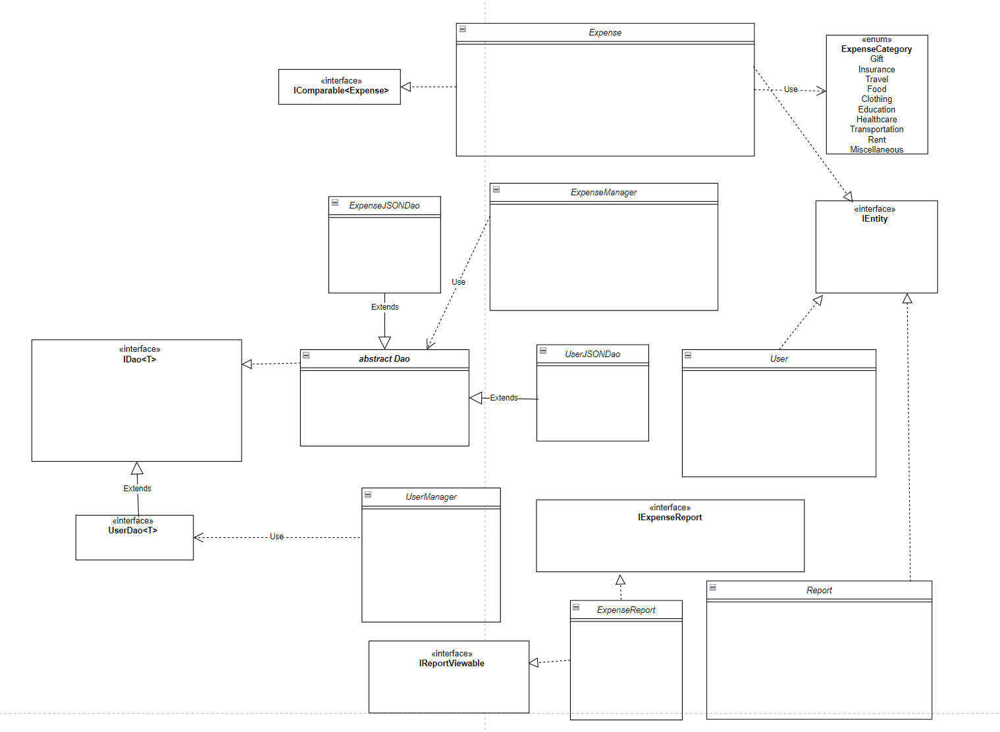
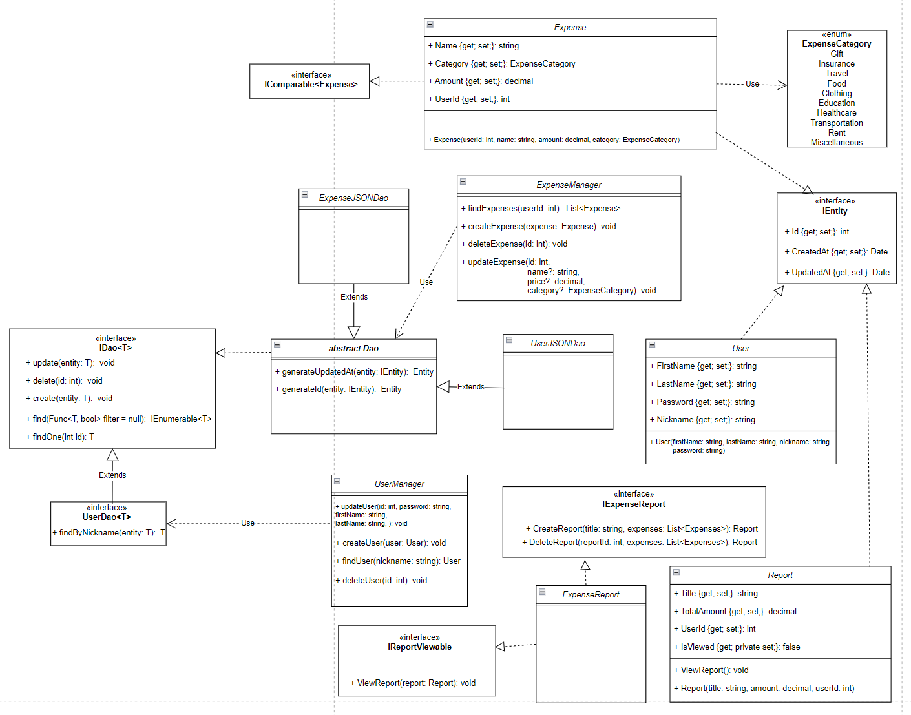

# Expense Tracker

This is a class project for an object-oriented programming course.

The subject area for a C# console application includes user financial management. The user can register in the system, input their financial expenses, and receive reports on expenditures over a specific period, such as a month or the entire usage time.

Key program features include:

 - User registration.

 - Expense addition.
	
 - Report generation

 - Viewing total expenses
 
This console application can assist the user in effectively tracking their finances and making informed financial decisions.

## Class diagram

